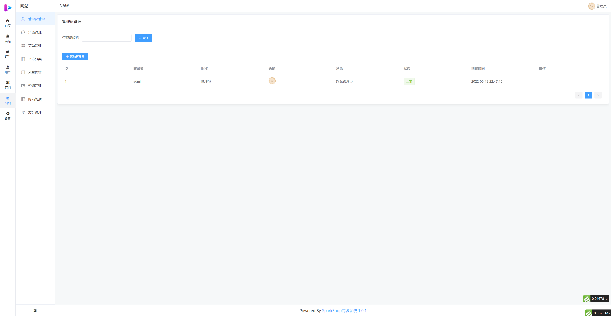

# SparkShop

## 介绍
SparkShop(星火商城)是基于thinkphp6 + elementui的开源免费可商用的高性能商城系统；包含小程序商城、H5商城、公众号商城、PC商城、App，支持秒杀、优惠券、积分、会员等级。营销功能采用插件化的方式方便扩展、二次开发没系统大小任意控制。  
虽然你目前看到的SparkShop在众多的优秀的开源商城面前渺小的像一颗火苗，但是你要相信“星星之火，可以燎原”。SparkShop的使命就是坚持做优秀的开源商城系统，助力所有使用、喜欢他的用户最后以燎原之势实现自己的梦想。

## 软件架构
架构上我们选择当下最主流的也是最具兼容性的方案。  
1、管理后台我们采用 vue2 + elementui 方便你快速的入门并实现开发。相较于传统的jq框架来说，vue2 + elementui 具有更容写逻辑、更容在后台开发中使用标准且美观的样式优点。  
2、后台框架采用 ThinkPHP6.x。tp算的上是国内框架中硕果仅存的还在维护且热度极高的php框架了，采用最新的框架既保证了项目的安全性也保证了项目的稳定性和二次开发的容易性。  
3、前端我们采用 UNIPP 来实现一套代码的编写从而兼容 APP + H5 + 小程序的多端部署的方案，为开发带来了很多的便利。

## 特技

为什么在拥有如此众多优秀的开源商城系统的今天，我们还开发一套开源的商城系统出来呢？我们是出于以下两点原因：  
1、当下大多开源的商城系统，已经做的足够的大了。很多的方法都糅杂在一起，但在我们实际的业务场景下，可能会出现 70% 的功能是不需要使用的，但是我们不得不为这 30% 的功能，而购买一个很庞商城系统，不仅增加了使用成本也增加了开发成本。SparkShop的理念是，采用`插件`的方式去扩展额外的功能，且支持`热拔插`。这带来的便利就是我们不需要的功能，可以完全的把他从我们的功能中，甚至是源码中直接无损伤的删除，仅保留最核心的基础代码。  
2、我们在二开很多优秀的商城系统的过程中发现，很多的开源商城系统的代码太具个性化，封装的很深。导致我们想更改某个功能不得不去代码中层层的翻找，SparkShop的理念是，采用 `平铺直叙` 的代码，只做必要的封装拆分，保证业务代码的简洁性和易读性。我们始终认为，容易读的代码，才是高级的代码。  

## 安装教程

https://k48rm6jpq3.k.topthink.com/@8lrxddk245/jieshao.html

## 演示环境

国内开源地址：https://gitee.com/nickbai/sparkshop

管理后台：https://sparkshop.pfecms.com/admin  账号：admin  密码：admin  
h5端地址：https://h5.pfecms.com/#/  账号：15695218888  密码：123123  【手机访问】

> 演示环境暂时用余额去支付，为了保证大家的效果，暂时禁止数据的操作。

## QQ交流群
<b>377210017</b> 

## 以下是部分内容展示

## 版权说明
1.允许用于个人学习、毕业设计、教学案例、公益事业、商业使用;  
2.如果商用必须保留版权信息 SparkShop ©，请自觉遵守;  
3.禁止将本项目的代码和资源进行任何形式的出售，产生的一切任何后果责任由侵权者自负。  
